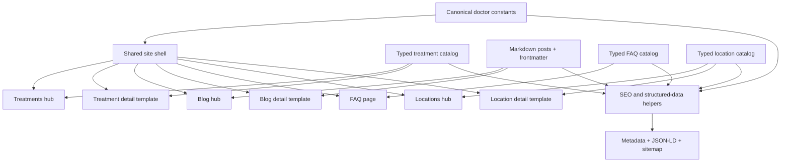

# SEO Subpage Foundation — Design

**Spec**: `.specs/features/content-subpages/spec.md`

**Context**: `.specs/features/content-subpages/context.md`

**Status**: Approved direction; implementation details ready for task breakdown

---

## Architecture Decision

### Chosen: Typed Catalogs + Markdown Articles + Shared Templates

This approach keeps structured practitioner, treatment, FAQ, and location
content in TypeScript modules while Markdown stores long-form blog content.
Reusable App Router pages read those sources and derive visible content,
metadata, JSON-LD, related links, and sitemap entries.

It was selected because it matches the maintainable patterns already used in
the Dayara and Clínica Massoni repositories, keeps the initial application
static, and makes later editorial updates independent of page-template code.

### Alternatives Considered

| Approach | Benefit | Cost | Decision |
| --- | --- | --- | --- |
| Typed catalogs + Markdown + dynamic templates | Flexible content, central validation, minimal route duplication | Requires parsers/validators and shared models | Chosen |
| All content in TypeScript | Few dependencies and strong typing | Long-form articles become awkward to edit and review | Rejected |
| Bespoke route file per topic | Maximum page-specific control | Duplicated metadata/schema/layout and expensive future updates | Rejected |

## Architecture Overview



## Proposed File Structure

```text
app/
  blog/
    [slug]/page.tsx
    page.tsx
  locais-de-atendimento/
    [slug]/page.tsx
    page.tsx
  perguntas-frequentes/page.tsx
  sobre/page.tsx
  tratamentos/
    [slug]/page.tsx
    page.tsx
  components/
    content/
      ArticleAside.tsx
      AuthorCard.tsx
      Breadcrumb.tsx
      FaqAccordion.tsx
      PageIntro.tsx
      RelatedContent.tsx
      TreatmentCard.tsx
    custom/
      AppointmentCta.tsx
    layout/
      Footer.tsx
      Header.tsx
      SiteShell.tsx
  lib/
    blog.ts
    content-validation.ts
    faqs.ts
    locations.ts
    navigation.ts
    seo.ts
    structured-data.ts
    treatments.ts
content/
  posts/
tests/
  unit/
  e2e/
```

Exact files will be reduced where a component has only one genuine consumer.
The structure is a boundary map, not a mandate to create empty abstraction
files.

## Code Reuse Analysis

### Existing Components to Leverage

| Component or pattern | Location | How to use |
| --- | --- | --- |
| Existing header | `app/components/layout/Header.tsx` | Preserve markup/branding; make navigation route-aware |
| Existing mobile navigation | `app/components/layout/HeaderMobileMenu.tsx` | Preserve disclosure and focus behavior |
| Existing footer | `app/components/layout/Footer.tsx` | Extend navigation and route links without replacing its identity |
| Tracked WhatsApp link | `app/components/analytics/TrackedWhatsAppLink.tsx` | Canonical tracked CTA primitive |
| Floating WhatsApp | `app/components/custom/WhatsAppFloatButton.tsx` | Keep as the sole fixed mobile conversion control |
| Existing FAQ disclosure | `app/components/sections/FaqSection.tsx` | Extract/reuse native accessible disclosure behavior |
| Existing sections and constants | `app/components/sections/*`, `constants.ts` | Source approved profile, expertise, FAQ, and Campo Grande facts |
| Existing design tokens | `app/globals.css` | Extend brand colors, surfaces, buttons, cards, and focus styles |
| Reference treatment model | `../dayarasalomao/src/lib/treatments.ts` | Adapt typed catalog and cross-reference helpers, not medical copy |
| Reference content/sitemap tests | `../clinicamassoni/web/tests/` | Adapt coverage ideas to Paulo's simpler stack |

### Integration Points

| System | Integration method |
| --- | --- |
| Next.js App Router | Static and dynamic server-rendered route files with `generateStaticParams` and `generateMetadata` |
| Existing analytics | Route-specific labels passed through `TrackedWhatsAppLink` |
| Existing sitemap | Extend `app/sitemap.ts` from canonical published inventories |
| Existing robots | Keep canonical sitemap discovery in `app/robots.ts` |
| Existing JSON-LD | Move shared serialization/builders into structured-data helpers |
| Markdown content | Filesystem parser executes at build time; no runtime CMS/network dependency |

## Components

### SiteShell

- **Purpose**: Render the shared header, footer, main-content boundary, and
  floating WhatsApp action once for all public routes.
- **Location**: `app/components/layout/SiteShell.tsx`
- **Interface**: `SiteShell({ children }): ReactNode`
- **Dependencies**: Existing Header, Footer, WhatsAppFloatButton.
- **Reuses**: Current homepage shell.

The final implementation may place these elements directly in the root layout
if that is simpler than retaining a named wrapper.

### Breadcrumb

- **Purpose**: Render visible, semantic route ancestry shared by inner pages.
- **Location**: `app/components/content/Breadcrumb.tsx`
- **Interface**:
  `Breadcrumb({ items: Array<{ name: string; href?: string }> }): ReactNode`
- **Dependencies**: Next Link.
- **Reuses**: Stitch hierarchy; JSON-LD builder consumes the same item shape.

### PageIntro

- **Purpose**: Consistent eyebrow, H1, lead, and optional supporting action.
- **Location**: `app/components/content/PageIntro.tsx`
- **Interface**: Typed presentational props with `title`, `eyebrow`,
  `description`, and optional children.
- **Dependencies**: None.
- **Reuses**: Existing badge and container styles.

### TreatmentCard

- **Purpose**: Render one catalog item in the treatment hub or related-content
  block without embedding medical copy.
- **Location**: `app/components/content/TreatmentCard.tsx`
- **Interface**: `TreatmentCard({ treatment, headingLevel }): ReactNode`
- **Dependencies**: Treatment model, Next Link.
- **Reuses**: Existing card/panel visual language and Stitch hierarchy.

### FaqAccordion

- **Purpose**: Render visible FAQ content from one canonical collection.
- **Location**: `app/components/content/FaqAccordion.tsx`
- **Interface**: `FaqAccordion({ items, theme }): ReactNode`
- **Dependencies**: FAQ model.
- **Reuses**: Existing native `details/summary` implementation.

### AppointmentCta

- **Purpose**: Render contextual appointment copy and tracked WhatsApp action.
- **Location**: `app/components/custom/AppointmentCta.tsx`
- **Interface**: `AppointmentCta({ heading, body, message, eventLocation }): ReactNode`
- **Dependencies**: WhatsApp URL helper and TrackedWhatsAppLink.
- **Reuses**: Existing CTA and dark-petrol section styling.

### AuthorCard and ArticleAside

- **Purpose**: Attribute medical content, expose credentials, provide optional
  table of contents, and connect articles/treatments to profile and appointment
  routes.
- **Location**: `app/components/content/AuthorCard.tsx`,
  `app/components/content/ArticleAside.tsx`
- **Interfaces**: Doctor content and heading-link props only.
- **Dependencies**: Canonical doctor constants and AppointmentCta.
- **Reuses**: Stitch editorial two-column layout.

## Data Models

### Publication State

```ts
type PublicationState = "draft" | "published";
```

Public discovery requires `state === "published"`, content validation, and
the model-specific indexing flag where one exists.

### Treatment

```ts
interface Treatment {
  slug: string;
  state: PublicationState;
  indexable: boolean;
  group: "peripheral-nerve" | "spine" | "rehabilitation";
  title: string;
  shortDescription: string;
  primaryIntent: string;
  metaTitle: string;
  metaDescription: string;
  summary: string;
  sections: Array<{
    id: string;
    heading: string;
    paragraphs: string[];
    bullets?: string[];
  }>;
  indications: string[];
  limitations: string[];
  carePath: string[];
  faqs: FaqItem[];
  relatedTreatmentSlugs: string[];
  relatedPostSlugs: string[];
  keywords: string[];
  lastModified: string;
  order: number;
}
```

### Blog Frontmatter

```ts
interface BlogFrontmatter {
  title: string;
  metaDescription: string;
  slug: string;
  state: PublicationState;
  publishDate: string;
  lastModified: string;
  primaryKeyword: string;
  secondaryKeywords: string[];
  targetAudience: "patients" | "caregivers" | "professionals" | "general-public";
  intent: "awareness" | "consideration" | "decision";
  featured: boolean;
  order: number;
  author: "paulo-araujo";
  relatedTreatmentSlugs: string[];
  faqs?: FaqItem[];
}
```

### FAQ

```ts
interface FaqItem {
  id: string;
  state: PublicationState;
  category: "consultation" | "treatment" | "recovery" | "location" | "scheduling";
  question: string;
  answer: string;
  order: number;
  relatedHref?: string;
}
```

### Location

```ts
interface PracticeLocation {
  slug: string;
  state: "active" | "inactive" | "planned";
  indexable: boolean;
  clinicName: string;
  city: string;
  region: string;
  address?: {
    street: string;
    locality?: string;
    postalCode?: string;
  };
  phone?: string;
  hours?: string[];
  mapUrl?: string;
  schedulingCopy: string;
  firstVisitSteps: string[];
  treatmentSlugs: string[];
  faqs: FaqItem[];
  whatsappMessage: string;
  lastModified: string;
}
```

## SEO Design

- A canonical URL helper owns path/absolute URL generation.
- Each route family owns a metadata builder that accepts only validated content.
- JSON-LD serializers escape unsafe `<` characters before embedding.
- Breadcrumb UI and `BreadcrumbList` use the same item array.
- FAQ JSON-LD is built from the exact visible FAQ collection.
- Sitemap inventory comes from the same static routes and published catalogs used
  by hubs and dynamic pages.
- Draft/inactive/incomplete detail entries are excluded from static params,
  discovery, and sitemap and resolve through `notFound()`.
- Empty hubs intentionally render `noindex,follow`; no content page receives
  `noindex` merely through robots.txt.
- Honest last-modified values come from content fields or an explicit static
  route table, never `new Date()` on every deployment.

## Error Handling Strategy

| Scenario | Handling | User impact |
| --- | --- | --- |
| Unknown/unpublished detail slug | `notFound()` | Normal branded 404 |
| Invalid publishable content | Descriptive build-time error | Deployment blocked before public impact |
| Missing optional media/address/map | Omit block entirely | Layout remains complete |
| Missing related unpublished target | Validation failure for published source | No broken public link |
| Empty blog/treatment/location hub | Intentional empty state plus `noindex,follow` | Honest page without thin indexing |
| Analytics unavailable | CTA navigation continues | No conversion-path failure |
| External link unavailable | No runtime fetch dependency | Local route remains usable |

## Risks & Concerns

| Concern | Location | Impact | Mitigation |
| --- | --- | --- | --- |
| Existing shell is composed in the homepage instead of globally | `app/page.tsx` | New routes may duplicate header/footer/floating CTA | Move composition into a shared shell/root layout as an early atomic task |
| Current navigation is mostly hash-based | `constants.ts`, header/footer components | Links fail when entered from subpages | Introduce canonical route-aware navigation data |
| Doctor/location facts are repeated across constants and layout JSON-LD | `constants.ts`, `app/layout.tsx` | Visible/schema drift | Derive structured data and subpages from canonical constants |
| No tests or test scripts exist | `package.json` | SEO/content regressions lack deterministic gates | Add an approved unit + browser test stack before content systems |
| Stitch exports contain fabricated facts and claims | `tmp/**` | Medical, ethical, and local SEO inaccuracies | Keep `tmp` untracked; whitelist current facts; treat copy as unapproved reference |
| Existing local React Grab diff is unrelated | `app/layout.tsx`, `.agents/`, `.claude/` | Accidental inclusion in epic commits | Stage explicit task file lists only |
| Long-form content can inflate client bundles | Future detail pages | Slower pages and reduced Core Web Vitals | Keep pages server-rendered; isolate only interactive disclosure/menu code |
| No current Markdown dependencies | `package.json` | Blog parser cannot be implemented without new packages | Add only the proven minimal parser/renderer dependencies in an atomic build task |

## Tech Decisions

| Decision | Choice | Rationale |
| --- | --- | --- |
| Content architecture | Typed catalogs plus Markdown articles | Flexible editing with strong structure |
| Rendering | Server Components/static generation by default | SEO, performance, and minimal client JavaScript |
| FAQ behavior | Native disclosure first | Accessible and resilient without JavaScript |
| Visual adoption | Adapt Stitch hierarchy; retain existing brand/assets | Captures the useful design without importing generated debt |
| Mobile navigation | Existing header/menu + WhatsApp FAB | Avoids competing fixed navigation in the first slice |
| Indexing | Completeness-gated publication | Prevents thin, false, or orphaned pages |
| First build slice | Shared shell and content primitives before route-specific copy | Establishes low-risk reusable foundations |
